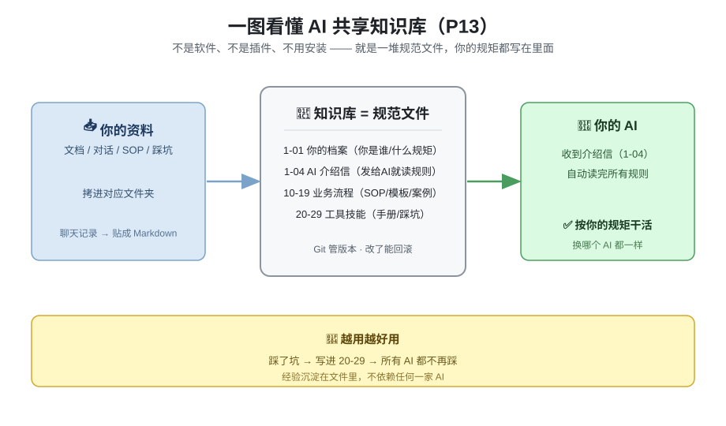

<p align="center">
  <h1 align="center">🤖 AI 共享知识库模板</h1>
  <p align="center">
    <strong>一套文件规范，让所有 AI 用同一份脑子干活</strong>
  </p>
  <p align="center">
    豆包 / Kimi / DeepSeek / ChatGPT / Claude / OpenClaw 全平台通用
    <br />
    告别每次换 AI 都要重新自我介绍、重新讲规则
  </p>
</p>

<p align="center">
  
  
  
  
  
</p>

---

## 🚀 这是给 AI 用的 skill，人只需要做 2 件事（第 2 件其实也可以不说）

### 第一步：文件夹放哪里？

和你的项目文件夹**平行**放（一般个人或团队会有多个项目）。这里的"项目"泛指：**一切需要用 AI 辅助干活的事情**——软件开发、教材课件开发、个人学习规划、生产或财务数据分析、资料整理等等。

> 怎么拿到文件夹：点本页右上角绿色「Use this template」，或直接下载 ZIP 解压。

### 第二步：把 `_入项指引.md` 发给你的 AI

不用学、不用配、不用读文档。打开你常用的桌面端 AI（豆包 / Kimi / WorkBuddy / OpenClaw 等**能读写本地文件**的），把知识库里的 `_入项指引.md` **内容贴给它**（或直接把文件路径给它，都一样），说一句"读这个，以后按它干活"就行。

**AI 自己就懂了。你只管开口提需求——连"这个 skill 是什么、怎么用"都直接问 AI，不用你自己先搞明白。**

> 💡 **第一次接触的新人看这句**：AI 读完 `_入项指引.md` 后会先跟你"交个底"——告诉你这套东西是给 AI 用的、你不用学任何文档，并确认你用的是**能读本地文件的桌面端 AI**（网页版跑不起来）。顺着它的引导走就行，那是专门给新人设计的开场，不是让你去读文档。

---

> 💡 **这个 skill 颠覆了什么？** 别的 skill 教人用；这里反过来——**skill 是给 AI 用的，人只跟 AI 对话**。人不需要懂体系，AI 负责把知识库和 skill 捞起来用，还负责"先懂你、再办事"。[详述：创新亮点-应用模式颠覆.md]

---

> ✋ **到这一步就能用了。下面的内容给想深究的人和 AI 看，上手不用读。**

---

## ✨ 为什么需要这个？

你是不是也遇到过这些问题：
- 😫 换个 AI 平台就要重新解释你是谁、做什么的、有什么规则
- 😫 刚在豆包调好的辅导计划格式，换 Kimi 又写跑偏了
- 😫 上次踩的坑（比如"VBS换行必须用 vbCrLf"），换个 AI 又踩一遍
- 😫 项目太多不知道哪个在哪个目录，每次派活都要翻半天

**这个模板就是解决这些问题的**：一套通用的文件规范，所有 AI 共用同一份记忆、同一份规则，换平台不换脑子。

## 📂 一图看懂



## 📖 真实使用案例

### 🏭 企业咨询项目试点
某精密制造企业在做现场改善咨询项目时，把这套知识库作为子文件夹放进项目目录，只保留了7个最核心的规范文件。不管用哪个AI来写辅导计划、整理改善案例、做培训课件，只要把入项指引发过去，AI自己就知道项目规矩、文件位置、输出格式，不用咨询师每次都重新讲一遍要求，协作效率提升很明显。

### 👨‍💻 作者自己的故事
作者平时同时用8个不同的AI干活，最头疼的就是换个AI就要重新自我介绍、重新讲规则，刚在这个AI里定好的格式，换个AI又写跑偏了。踩了无数坑之后，花了3天时间让8个AI一起迭代出了这套规范，现在换AI就像换同事，规矩都是现成的，不用再重复沟通。

完整故事看这篇知乎文章：[8个AI三天迭代出一套知识库，然后我把它开源了](https://zhuanlan.zhihu.com/p/2066539122500678312)
这套系统里30条从真实踩坑长出来的协作机制，看这里：[1-07_机制亮点清单.md](./1-07_机制亮点清单.md)

## 🚀 核心能力

| 能力 | 说明 |
|------|------|
| 🪙 **免费额度最大化** | 豆包免费问答 + Kimi长文档 + DeepSeek深度推理 → 组合用，不花一分钱 |
| 🔍 **AI 互相审核** | A 写完 B 审，换模型交叉验证，大幅降低幻觉和低级错误 |
| 🤝 **多 AI 工单协作** | 大项目拆成小任务派单，多个AI并行不抢活、不冲突，批量任务自动跑，像管小团队一样管AI |
| 📝 **经验永久沉淀** | 踩一次坑记下来，所有 AI 自动避开，不用重复踩坑 |
| 🧠 **自我进化** | 经验自动分级可信度（3次才升规则），越用越准，不误学、不重复踩、不越积越乱 |
| 🧩 **零依赖开箱即用** | 纯 Markdown，不需要数据库、不需要服务，下载就能用 |

> ✅ 个人用：效率直接翻倍；小团队用：所有 AI 遵守同一套规则，谁改了什么 Git 全留痕。

## 🛡️ 内置防呆机制（踩了几十次坑总结的精华）

这些都是实际用多AI协作踩坑踩出来的规则，从根源上避免90%的常见问题：

| 防呆规则 | 解决什么坑 |
|---------|-----------|
| 📂 **项目入项强制阅读** | 每个项目根目录自带 `_入项指引.md`，新AI进项目必须先读这个再干活，不会再出现"不知道规则乱改文件" |
| 🗂️ **Git版本管理，禁止乱备份** | 所有文件靠Git做版本管理，**不需要单独备份文件**（禁止生成`xxx_v0备份`这种冗余文件），改坏了一行命令回滚，再也不会出现一堆备份文件分不清哪个是最新的 |
| 📄 **双版分离，禁止手改生成文件** | MD源文件给AI改，HTML/导出文件脚本自动生成，禁止手改生成文件——再也不会出现"手改的内容下次生成被覆盖" |
| 🎯 **一句话派活公式** | 派活只需要说：`打开项目\_入项指引.md，读完后做：xxx`，AI自动读所有规则，不用每次重复讲要求 |
| 🧠 **记忆分层铁律** | 重要信息必须写入文件，不能只存在AI脑子里——换AI、换平台不会丢记忆 |
| 🎯 **单一事实来源** | 同一条知识只在一个文件维护，其他地方只引用不复制——再也不会出现"同一个规则A文件改了B文件没改，AI看B文件做错" |
| ✍️ **改完立即提交署名** | 改完文件必须立即Git提交，带上AI平台名——谁改了什么、什么时候改的一目了然，出问题一秒回溯 |
| 📝 **文件头元信息强制** | 每个文件开头必须有「用途/关键词/更新日期」三行，AI一秒判断要不要读这个文件，不会读错、漏读 |
| ⚠️ **冲突不擅自改** | 遇到规则冲突、不确定的地方，AI不能自己改，必须先问你——不会出现AI自作主张改坏你的规范 |
| 🚫 **禁止重复记工作流** | Git就是唯一工作记录，不需要额外记日志、记改了什么——减少冗余工作 |
| 📻 **多AI协作对讲机协议** | 多AI同时干活不抢单、不覆盖、不冲突，工单状态机+追加制，8个AI同时写一张表也不会乱 |
| 🏷️ **三级验收防翻车** | L0免验（机械操作）/ L1抽查（内容产出）/ L2全验（高风险），级别在派单时写明，翻车自动升级 |
| 📝 **阴性结果留痕** | 审过没发现≠没审——每次验收必须留记录，防止"到底审了没有"扯皮 |
| 🧱 **防呆闭环体系** | 每个问题走 5 步闭环变机制：能 L1 断根不 L2 检测、能 L2 检测不 L3 靠人记；配套防呆台账+检查设计三铁律（名实相符/未验证≠通过/抽样写条件），见 `1-09_防呆与持续改善.md` |

## 📁 目录结构（给好奇的人看的，不用全读）

```
ai-knowledge-base-template/
├── _入项指引.md               # 🎫 【唯一要发给AI的文件】AI读完秒懂整套体系（核心使命：先懂人、再办事）
├── 创新亮点-应用模式颠覆.md     # 💡 skill给AI用、人只对话——双重错位解法与推广卖点
├── 1-01_用户档案.md            # 📝 你的信息（身份/偏好/规则/客户/环境）—— AI帮你填，不用手改
├── 1-02_知识库管理规范.md       # 📏 Meta规则：五条核心原则、文件编号、开工/完工清单、立项SOP
├── 1-03_平台攻略.md            # 💡 多平台组合策略：哪个AI擅长干什么、怎么蹭免费额度
├── 1-04_接入指令模板.md         # 🎫 新AI入职转发卡（三轨：快速通道/完整入职/开工对齐）
├── 1-05_多AI协作规范.md         # 🤝 【可选】多AI同时干活的派单/防冲突规则，批量任务神器
├── 1-06_自我进化机制.md         # 🧠 【可选】让知识库从踩坑中"学乖"——经验可信度分级、命名空间继承、扩容治理
├── 1-07_机制亮点清单.md         # 🏆 实战长出来的30条创新机制——每条背后都有真事故
├── 1-08_指挥中心模板.md         # 📺 用户仪表盘模板：当前重点/待办/待决策/项目速查，复制即用
├── gen_html.py                # 🔧 指挥中心HTML生成器：复制1-08模板→指挥中心.md后跑它，一键生成 指挥中心.html
├── 1-09_防呆与持续改善.md       # 🧱 【可选】体系自愈：问题→防呆5步闭环、L1/L2/L3、检查设计三铁律
├── 4-01_主人知识树/            # 🌱 【空骨架·按需生长】学习体系：AI从对话读盲点、主动帮人跟上（_模块说明.md+空知识盲点.md，判断规则已内嵌）
├── 3-01_项目与技能登记.md       # 📋 所有项目+AI能力统一登记表，派活前先查表
│
├── 10-19_业务流程/           # 📚 放你的行业知识：辅导计划模板、PPT规范、业务SOP...
├── 20-29_工具技能/           # 🔧 放工具手册：HTML课件规范、SVG写法、踩坑记录...
│
└── 项目模板/                  # 📦 新项目模板：新建项目直接复制这个文件夹
    ├── _入项指引.md          # 每个项目自带入项规则，新AI进项目先读这个
    ├── 00_项目总览模板.md
    └── ...
```

## 🎯 适合谁用？

- 👤 **个人用户**：同时用多个 AI 平台，想统一管理自己的知识和项目
- 👥 **小团队**：想让团队里所有人用的 AI 都遵守同一套规范
- 🧑‍🏫 **咨询/培训/顾问**：有稳定的业务流程和模板，需要 AI 稳定复现你的标准
- 💻 **开发者/独立工作者**：同时用多个 AI 写代码、写文档，想沉淀自己的经验库
- 🚀 **研发团队**：需求文档、设计决策、踩坑记录——这些"代码之外的东西"才是团队最贵的资产。代码有 Git 管，协作规则谁来管？这套模板补的就是 Jira/飞书/Git 管不到的那块：**人跟人之间的隐性约定，显性化**

## 🎨 设计原则

1. **单一事实来源**：同一条知识只在一个文件里维护，不重复、不冲突
2. **地图与行李分离**：知识库只存规范和登记（地图），项目内容放各项目目录自治（行李）
3. **AI 优先设计**：规范文件写给 AI 读（头部有标准元信息，AI 一秒判断该不该读）；README 写给人读（两步上手，不让用户碰文件）
4. **平台无关**：不绑定任何特定 AI 产品，豆包/Kimi/DeepSeek/Claude 都能用
5. **Git 友好**：纯文本 Markdown，Git 完美管理版本，谁改了什么一目了然
6. **最小可用**：不需要复杂部署，不需要数据库，下载就能用，想扩展随时加

## 🏭 精益管理视角

这套知识库本质上是在管"代码仓库之外的那层协作壳"——即**人跟人之间的约定**。

Git 管代码、这套模板管协作线——同一套精益思维，换了个数字场景：

| 精益概念 | 传统工厂 | 本知识库 |
|---------|---------|-----------|
| 标准作业 | 每个工位标准操作流程 | 入项指引——谁进来都一样，不用老师傅带 |
| 防呆 Poka-Yoke | 不会装错的零件 | 工单状态机——不是你的环节你改不了 |
| 可视化管理 | 看板，一眼看到瓶颈 | 工单索引表——谁在干什么、卡在哪，一查就知道 |
| 安灯 Andon | 拉绳停线，暴露问题 | 待决策 + 提问中——卡住了立即暴露，不等烂掉 |
| 持续改善 Kaizen | 改善提案→试行→标准化 | 踩坑→台账→固化规范→同类归零闭环 |
| 单件流 | 一个一个过，不堆积 | 一单一文件——不堆积，不互相覆盖 |

软件开发最贵的成本从来不是服务器，是"上一个人离职后，没人知道这个设计为什么这么定"。
知识库就是你的数字产线——把团队脑子里的经验写成可传承的规则。

## ❓ 常见问题

**Q：我不会用 Git 能用吗？**
A：完全可以，直接下载 ZIP 解压就能用。Git 只是 AI 帮你做版本管理的工具——你不学，AI 自己会。

**Q：我需要打开那些 MD 文件改东西吗？**
A：不需要。MD 文件是给 AI 看的。连 `1-01_用户档案.md` 都是跟 AI 聊着天它就帮你填好了。你唯一可能打开的文件就是 `_入项指引.md`——复制它的内容发给 AI。

**Q：我只有网页版 AI（豆包网页版/Kimi 网页版/ChatGPT 网页）能用吗？**
A：**不行，本 SKILL 不适用网页版 AI。** 这套体系的核心设计假设 AI 能**读写你本地文件**——读项目、改文档、生成仪表盘、Git 提交都依赖这个能力；网页版 AI 读不到你电脑上的文件夹，这些活都干不了。请用**桌面端 AI**（OpenClaw / WorkBuddy / 豆包桌面端 / Kimi 这类装在电脑上的），满血体验：AI 自动读文件、改文件、提交一气呵成。

**Q：我已经有自己的文件结构了怎么办？**
A：模板只是参考，你可以完全按照自己的习惯改目录结构，只要遵守最基础的文件规范就行。

**Q：可以商用吗？**
A：完全可以，MIT 协议，随便用、随便改，只要保留原作者署名就行。

**Q：这到底是啥？**
A：一堆规范文件，你的规矩都写在里面，AI 读了就按你的规矩干活。文件夹放对位置 + 把入项指引发给 AI，剩下的问 AI 就行。

## 🔄 版本与升级（模板和实例怎么分工）

模板持续进化（当前 v1.0.7）。记住一句话：**机制随版本走，台账各自长，行业包各自填。**

- **你的东西永远是你的**：clone 之后，`1-01` 档案、防呆台账、`10-19/20-29` 行业内容、各项目——全是你的本地文件，放心长，模板升级永远撞不上
- **机制层升级看 Release**：入职协议、防呆闭环、多AI协作协议这类机制的改进会写在 [Release](https://github.com/SamieSYL2093/ai-knowledge-base-template/releases) 里，看中了就把对应文件抄过去，看不中就当没看见——你的本地内容不受影响
- **发现模板本身的洞？** 你台账记的是你自己踩的坑；如果坑是模板机制造成的（规则有歧义、流程会撞车），欢迎提 Issue 回流上游——改进了惠及所有人

> 这一节看不懂没关系——它主要是给你的 AI 看的。直接问它一句"模板升级了我要跟吗 / 这个坑该不该提 Issue"，它会用大白话告诉你。

## 🤝 贡献指南

欢迎提交 Issue 和 PR！
- 有新的平台使用技巧？欢迎补充到 `1-03_平台攻略.md`
- 有更好的规范设计？欢迎提 Issue 讨论
- 发现bug？直接提 Issue 或者 PR

## 📄 License

MIT License © 2026
- 随便用、随便改
- 用于个人或商业都可以
- 保留原作者署名就好

---

<p align="center">
  如果这个模板帮你省了时间，欢迎点个 ⭐ Star 支持一下！
</p>
